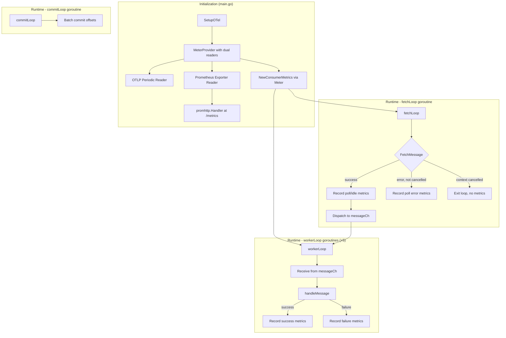

# Design Document: Kafka Consumer Metrics (Confirmation Service)

## Overview

This design adds standardized Kafka consumer metrics instrumentation to the GlobeCo Confirmation Service's worker-pool-based Kafka consumer. The implementation uses the OpenTelemetry Go SDK to create metric instruments (counters and histograms) and bridges them to the existing Prometheus `/metrics` endpoint via the `go.opentelemetry.io/otel/exporters/prometheus` package.

The core idea is a thin `ConsumerMetrics` struct that encapsulates all eight OTel instruments and exposes recording methods. The `fetchLoop` goroutine is instrumented for poll/idle timing, and each `workerLoop` goroutine (via `handleMessage`) is instrumented for processing timing and outcome recording. No business logic changes are required — the metrics layer is purely observational.

**Key design decisions:**
1. **OTel Prometheus exporter as second MeterProvider reader** — extends the current OTLP-only metric reader with a dual-reader setup (OTLP periodic + Prometheus exporter) so instruments are visible at both the OTLP collector and the `/metrics` endpoint.
2. **Single struct, initialize-once pattern** — all instruments are created at startup and stored in a struct passed to `KafkaConsumerService`. No per-message allocations.
3. **Poll metrics in fetchLoop, processing metrics in workerLoop** — adapts the single-loop FIX Engine approach to the confirmation service's multi-goroutine architecture. The `fetchLoop` is the single measurement point for poll/idle metrics; each worker independently measures its own processing duration.
4. **Monotonic timing via `time.Now()` / `time.Since()`** — Go's standard library guarantees monotonic clock usage in duration calculations.
5. **Message creation time resolution as a pure function** — extracted into a standalone function for easy property-based testing.
6. **Thread-safe by design** — OTel SDK instruments are safe for concurrent use; the `ConsumerMetrics` struct holds only immutable references after construction, requiring no additional synchronization.

## Architecture



The metrics flow:
1. At startup, `SetupOTel` creates a `MeterProvider` with two readers: the existing OTLP periodic reader and a new Prometheus exporter reader.
2. `NewConsumerMetrics` obtains a `Meter` from the provider and creates all 8 instruments.
3. The `ConsumerMetrics` struct is injected into `KafkaConsumerService`.
4. In `fetchLoop`: timing is captured around `FetchMessage`. On success, poll/idle metrics are recorded and the message is dispatched. On non-cancellation error, poll error metrics are recorded.
5. In `workerLoop`/`handleMessage`: timing starts when the worker begins handling the message. At terminal outcome (success or failure after resilience handling), processing metrics, duration histogram, and latency histogram are recorded.
6. Prometheus scrapes `/metrics` and sees all OTel-registered instruments alongside existing direct-registered Prometheus metrics.

## Components and Interfaces

### 1. `internal/metrics/consumer_metrics.go` — ConsumerMetrics struct

```go
package metrics

import (
    "context"
    "go.opentelemetry.io/otel/attribute"
    "go.opentelemetry.io/otel/metric"
)

// ConsumerMetrics holds all Kafka consumer metric instruments.
// All fields are immutable after construction; safe for concurrent use.
type ConsumerMetrics struct {
    messagesProcessed  metric.Int64Counter
    messagesFailed     metric.Int64Counter
    processingSeconds  metric.Float64Counter
    idleSeconds        metric.Float64Counter
    recordsPolled      metric.Int64Counter
    pollSeconds        metric.Float64Counter
    processingDuration metric.Float64Histogram
    messageLatency     metric.Float64Histogram

    // Pre-computed common attributes (service + consumer_group).
    // Topic and partition are added per-observation.
    commonAttrs []attribute.KeyValue
}

// NewConsumerMetrics creates and registers all metric instruments.
// Returns an error if any instrument cannot be created.
func NewConsumerMetrics(meter metric.Meter, consumerGroup string) (*ConsumerMetrics, error)

// RecordPollSuccess records metrics after a successful FetchMessage call.
// Called from the fetchLoop goroutine only.
func (m *ConsumerMetrics) RecordPollSuccess(ctx context.Context, pollDuration float64, topic string, partition int)

// RecordPollError records metrics after a failed FetchMessage (non-cancellation).
// Called from the fetchLoop goroutine only.
func (m *ConsumerMetrics) RecordPollError(ctx context.Context, pollDuration float64)

// RecordProcessingSuccess records metrics after successful message processing.
// Called from workerLoop goroutines.
func (m *ConsumerMetrics) RecordProcessingSuccess(ctx context.Context, processingDuration float64, latency *float64, topic string, partition int)

// RecordProcessingFailure records metrics after failed message processing.
// Called from workerLoop goroutines.
func (m *ConsumerMetrics) RecordProcessingFailure(ctx context.Context, processingDuration float64, latency *float64, topic string, partition int)
```

**Recording method behavior:**

| Method | Instruments Updated |
|---|---|
| `RecordPollSuccess` | `records_polled_total` (+1), `poll_seconds_total` (+duration), `idle_seconds_total` (+duration) |
| `RecordPollError` | `poll_seconds_total` (+duration), `idle_seconds_total` (+duration) |
| `RecordProcessingSuccess` | `messages_processed_total` (+1), `processing_seconds_total` (+duration), `processing_duration_seconds` (observe), `message_latency_seconds` (observe, if latency != nil) |
| `RecordProcessingFailure` | `messages_failed_total` (+1), `processing_seconds_total` (+duration), `processing_duration_seconds` (observe), `message_latency_seconds` (observe, if latency != nil) |

All recording methods wrap operations in a `defer recover()` block to prevent panics from propagating to the consumer loop.

### 2. `internal/metrics/creation_time.go` — Message creation time resolution

```go
package metrics

import (
    "time"
    "github.com/segmentio/kafka-go"
)

// ResolveMessageCreationTime extracts the message creation timestamp using
// priority: (a) created_at header, (b) createdAt/created_at payload field, (c) Kafka record timestamp.
// Returns the resolved time and whether a valid time was found.
func ResolveMessageCreationTime(msg kafka.Message, payloadJSON []byte) (time.Time, bool)

// CalculateLatency computes end-to-end latency and applies clamping rules.
// Returns the latency in seconds and whether it should be recorded.
// Rules: latency >= 0 → record as-is; -1s < latency < 0 → clamp to 0; latency <= -1s → skip.
func CalculateLatency(creationTime time.Time, completionTime time.Time) (float64, bool)
```

**Header parsing formats:**
- Unix epoch milliseconds: integer string (e.g., `"1700000000000"`) → divide by 1000
- Unix epoch seconds: decimal string (e.g., `"1700000000.123"`)
- RFC 3339: standard format (e.g., `"2024-01-15T10:30:00Z"`)

**Payload field parsing:**
- Numeric JSON value: treated as Unix epoch milliseconds
- String JSON value: parsed as RFC 3339

**Skip conditions:**
- Source absent or empty
- Non-parseable value
- Parsed time has non-positive epoch (≤ 0)

### 3. `internal/utils/otel.go` — Modified SetupOTel

The existing `SetupOTel` function is extended to:
- Import and create a Prometheus exporter via `prometheus.New()`
- Add the Prometheus exporter as a second reader on the `MeterProvider` using `metric.WithReader(promExporter)`
- Keep the existing OTLP periodic reader intact (dual-reader setup)
- The Prometheus exporter auto-registers with `prometheus.DefaultRegisterer`, making OTel instruments visible via `promhttp.Handler()` at `/metrics`

```go
// SetupOTel now creates dual readers: OTLP periodic + Prometheus exporter.
// The Prometheus exporter registers with prometheus.DefaultRegisterer,
// making instruments visible via promhttp.Handler() on /metrics.
func SetupOTel(ctx context.Context, config OTelConfig) (func(context.Context) error, error)
```

### 4. `internal/service/kafka_consumer.go` — Instrumented fetchLoop and handleMessage

The `KafkaConsumerService` struct gains a `ConsumerMetrics *metrics.ConsumerMetrics` field (added to `KafkaConsumerConfig`).

**fetchLoop modifications:**
```
1. Capture pollStart = time.Now() immediately before FetchMessage call
2. Call FetchMessage
3. Compute pollDuration = time.Since(pollStart).Seconds()
4. If error is context.Canceled or context.DeadlineExceeded:
   → continue (no metrics recorded)
5. If error is non-nil (other error):
   → ConsumerMetrics.RecordPollError(ctx, pollDuration)
   → continue
6. If success:
   → ConsumerMetrics.RecordPollSuccess(ctx, pollDuration, msg.Topic, msg.Partition)
   → dispatch message to messageCh
```

**handleMessage modifications:**
```
1. Capture processingStart = time.Now() at entry
2. Store raw message.Value for creation time resolution
3. Execute existing logic (unmarshal, validate, resilience-wrapped handler)
4. At terminal outcome (success or failure):
   a. processingDuration = time.Since(processingStart).Seconds()
   b. Clamp non-positive to 0
   c. completionTime = time.Now()
   d. creationTime, ok = ResolveMessageCreationTime(message, message.Value)
   e. If ok: latency, shouldRecord = CalculateLatency(creationTime, completionTime)
   f. If success: RecordProcessingSuccess(ctx, processingDuration, &latency or nil, topic, partition)
   g. If failure: RecordProcessingFailure(ctx, processingDuration, &latency or nil, topic, partition)
```

### 5. `cmd/confirmation-service/main.go` — Wiring

```
1. After SetupOTel returns, obtain Meter:
   meter := otel.GetMeterProvider().Meter("globeco-confirmation-service")
2. Create ConsumerMetrics:
   consumerMetrics, err := metrics.NewConsumerMetrics(meter, cfg.Kafka.ConsumerGroup)
   // Fatal on error
3. Pass consumerMetrics to NewKafkaConsumerService via KafkaConsumerConfig
```

## Data Models

### Metric Instruments

| Metric Name | Type | Unit | Bucket Boundaries |
|---|---|---|---|
| `kafka_consumer_messages_processed_total` | Int64Counter | `1` | — |
| `kafka_consumer_messages_failed_total` | Int64Counter | `1` | — |
| `kafka_consumer_processing_seconds_total` | Float64Counter | `s` | — |
| `kafka_consumer_idle_seconds_total` | Float64Counter | `s` | — |
| `kafka_consumer_records_polled_total` | Int64Counter | `1` | — |
| `kafka_consumer_poll_seconds_total` | Float64Counter | `s` | — |
| `kafka_consumer_processing_duration_seconds` | Float64Histogram | `s` | 0.005, 0.010, 0.025, 0.050, 0.100, 0.250, 0.500, 1, 2.5, 5, 10, 30, 60 |
| `kafka_consumer_message_latency_seconds` | Float64Histogram | `s` | 0.010, 0.025, 0.050, 0.100, 0.250, 0.500, 1, 2.5, 5, 10, 30, 60, 120, 300, 600 |

### Label Schema

| Label | Source | Applied To |
|---|---|---|
| `service` | Literal `"globeco-confirmation-service"` | All instruments |
| `consumer_group` | Config `Kafka.ConsumerGroup` (default `"globeco-confirmation-service"`, fallback `"unknown"`) | All instruments |
| `topic` | `kafka.Message.Topic` (from fetched record) | All instruments (when message-associated) |
| `partition` | `strconv.Itoa(msg.Partition)` or `"unknown"` if invalid | All instruments (when message-associated) |
| `result` | `"success"` or `"failure"` | Histograms only (`processing_duration_seconds`, `message_latency_seconds`) |

**Note:** For `RecordPollError` (no message available), `topic` and `partition` are set to `"unknown"` since no record metadata exists.

### Message Creation Time Resolution

```
Priority 1: Kafka header "created_at"
  → Parse as: Unix epoch millis (int string), Unix epoch seconds (decimal), or RFC 3339
Priority 2: Payload field "createdAt" or "created_at"
  → Parse as: Unix epoch millis (numeric JSON), or RFC 3339 string
Priority 3: kafka.Message.Time (Kafka record timestamp)
  → Use directly if non-zero
Fallback: No valid time → skip latency observation, log warning
```

### Latency Clamping Rules

| Condition | Action |
|---|---|
| latency >= 0 | Record as-is |
| -1s < latency < 0 | Clamp to 0, record |
| latency <= -1s | Skip observation, log warning |

## Correctness Properties

*A property is a characteristic or behavior that should hold true across all valid executions of a system — essentially, a formal statement about what the system should do. Properties serve as the bridge between human-readable specifications and machine-verifiable correctness guarantees.*

### Property 1: Common labels always present and correct

*For any* metric observation produced by the Kafka consumer processing path (regardless of outcome — poll success, poll error, processing success, or processing failure), the observation SHALL contain the labels `service` (with value `"globeco-confirmation-service"`), `consumer_group` (with the configured value or `"unknown"` if empty), `topic`, and `partition` with correct values derived from the literal service name, configured consumer group, and the record's metadata.

**Validates: Requirements 2.1, 2.2, 2.3, 2.4, 2.6, 2.8, 2.9**

### Property 2: Success and failure counters are mutually exclusive and exhaustive

*For any* Kafka fill message that reaches a terminal outcome in a worker, the system SHALL increment exactly one of `kafka_consumer_messages_processed_total` (on success) or `kafka_consumer_messages_failed_total` (on failure) by 1, and SHALL NOT increment the other. For any `FetchMessage` error or context cancellation, neither counter SHALL be incremented.

**Validates: Requirements 3.1, 3.2, 3.4, 3.5, 4.1, 4.2, 4.6**

### Property 3: Time accounting conservation

*For any* complete fetch-then-process cycle (one `FetchMessage` call followed by one message processing in a worker), the elapsed time SHALL be partitioned into exactly two non-overlapping buckets: `kafka_consumer_idle_seconds_total` receives the Poll_Duration (time inside `FetchMessage`), and `kafka_consumer_processing_seconds_total` receives the Processing_Duration (time from worker receipt to terminal outcome). No time is double-counted between these two counters.

**Validates: Requirements 5.1, 5.2, 5.4, 5.5, 6.1, 6.2, 6.3, 14.3**

### Property 4: Poll counter increments iff FetchMessage succeeds

*For any* invocation of `FetchMessage`, `kafka_consumer_records_polled_total` SHALL increment by exactly 1 if and only if the call returns without error. On error (whether non-cancellation error or context cancellation), the counter SHALL NOT increment.

**Validates: Requirements 9.1, 9.2, 9.3, 9.4**

### Property 5: Poll seconds accumulates for all non-cancelled FetchMessage calls

*For any* `FetchMessage` call that completes (success or non-cancellation error), `kafka_consumer_poll_seconds_total` SHALL increase by the monotonic elapsed duration of that call. For context-cancelled calls, no poll time SHALL be recorded.

**Validates: Requirements 10.1, 10.2, 10.3, 10.4, 10.5**

### Property 6: Processing duration histogram records exactly one observation per terminal outcome

*For any* Kafka fill message reaching a terminal outcome in a worker, the system SHALL record exactly one observation to `kafka_consumer_processing_duration_seconds` with the correct `result` label (`"success"` or `"failure"`) and Common_Labels. The recorded value SHALL equal the monotonic elapsed time from when the worker began handling the message to terminal outcome, clamped to 0 if non-positive.

**Validates: Requirements 7.1, 7.2, 7.3, 7.4, 7.5, 7.6**

### Property 7: Message creation time priority resolution

*For any* Kafka message with any combination of `created_at` header values, payload `createdAt`/`created_at` fields, and `msg.Time` values, `ResolveMessageCreationTime` SHALL return the value from the highest-priority valid source: (a) `created_at` header > (b) `createdAt`/`created_at` payload field > (c) Kafka record timestamp. If a higher-priority source provides a valid parseable time, lower-priority sources SHALL be ignored regardless of their content.

**Validates: Requirements 8.3, 8.4, 8.5, 12.5**

### Property 8: Latency observation recorded iff valid creation time and non-negative (or clampable) result

*For any* Kafka fill message reaching a terminal outcome: if a valid `Message_Creation_Time` exists and the computed latency is >= -1s, the system SHALL record exactly one latency observation (clamped to 0 if negative but > -1s). If no valid creation time exists, or if latency < -1s, no observation SHALL be recorded.

**Validates: Requirements 8.1, 8.2, 8.6, 8.7, 8.8, 12.6**

### Property 9: Context cancellation produces zero metric observations

*For any* `FetchMessage` call interrupted by context cancellation (i.e., the error wraps `context.Canceled` or `context.DeadlineExceeded`), the system SHALL record zero metric observations of any kind for that call — no poll time, no idle time, no poll count, no processing metrics.

**Validates: Requirements 6.3, 6.4, 9.3, 10.4, 14.5**

### Property 10: Metric recording errors do not propagate to consumer loop

*For any* internal error or panic during a metric recording operation (nil instrument, attribute error, SDK panic), the error SHALL be suppressed (recovered if panic, discarded if error) and the consumer loop SHALL continue processing subsequent records without interruption.

**Validates: Requirements 14.4, 14.5**

### Property 11: Concurrency safety

*For any* set of concurrent goroutines (up to WorkerPoolSize workers + 1 fetchLoop) accessing the `ConsumerMetrics` struct simultaneously, the Go race detector SHALL report zero data races.

**Validates: Requirements 1.6, 13.3**

## Error Handling

| Error Scenario | Behavior |
|---|---|
| Instrument creation fails at startup | `NewConsumerMetrics` returns error → service does not start Kafka consumer |
| `FetchMessage` returns context cancellation | Continue loop, no metrics recorded for that call |
| `FetchMessage` returns `context.DeadlineExceeded` (fetch timeout) | Continue loop, no metrics recorded (treated as cancellation per existing behavior) |
| `FetchMessage` returns other error | Record poll duration to `poll_seconds_total` and `idle_seconds_total`, log error, continue loop |
| JSON deserialization fails | Record processing failure metrics (counter + histogram + latency if available), return error |
| Fill validation fails | Record processing failure metrics, return error |
| Resilience-wrapped handler fails (retries exhausted) | Record processing failure metrics, return error |
| Metric recording panics | Suppress via `defer recover()`, log at ERROR level, continue processing |
| Metric recording returns error | Discard, log at DEBUG level, continue processing |
| No valid Message_Creation_Time | Skip latency observation, log structured warning with partition/offset |
| Negative latency >= 1s absolute | Skip latency observation, log structured warning |
| Negative latency < 1s absolute | Clamp to 0, record observation normally |
| Non-positive monotonic duration | Clamp to 0, record normally |
| Empty consumer group config | Use `"unknown"` as label value |
| Invalid partition number | Use `"unknown"` as partition label |

## Testing Strategy

### Property-Based Tests (using `github.com/leanovate/gopter`)

Each correctness property is implemented as a property-based test with minimum 100 iterations. The property-based testing library `gopter` (Go Property Testing) is used for generator-based test input.

**Configuration:**
- Minimum 100 iterations per property test
- Each test tagged with: `Feature: kafka-consumer-metrics, Property {N}: {title}`
- Tests exercise the pure logic layer (creation time resolution, label computation, latency calculation) with generated inputs
- Consumer loop integration tests use a recording/mock `metric.Meter` to capture observations

**Property test targets:**

| Property | Test Target | Generator Strategy |
|---|---|---|
| Property 7 | `ResolveMessageCreationTime` | Generate random Kafka messages with random combinations of valid/invalid/absent header values, payload fields, and msg.Time |
| Property 8 | `CalculateLatency` | Generate random `creationTime`/`completionTime` pairs spanning positive, slightly-negative, and significantly-negative latencies |
| Property 2 | Recording methods + mock meter | Generate random processing outcomes (success/failure/error/cancellation), verify exactly one counter incremented per terminal outcome |
| Property 3 | Recording methods + mock meter | Generate random poll durations and processing durations, verify idle receives poll time and processing receives processing time with no overlap |
| Property 4 | `RecordPollSuccess`/`RecordPollError` + mock meter | Generate random poll outcomes (success, error, cancellation), verify counter increments only on success |
| Property 5 | Recording methods + mock meter | Generate random poll durations and outcomes, verify poll_seconds accumulates for non-cancelled calls only |
| Property 1 | Recording methods + mock meter | Generate random topic names, partitions, consumer groups; verify all four common labels attached with correct values |
| Property 9 | Full instrumented loop with mock reader | Generate random poll durations with cancelled context, verify zero observations |

### Unit Tests (example-based)

- **Instrument initialization**: Verify all 8 instruments created with correct names and types (Requirements 1.1–1.4)
- **Histogram boundaries**: Verify bucket boundaries match spec for both histograms (Requirements 1.2, 1.3)
- **Error propagation**: Verify `NewConsumerMetrics` returns error on instrument creation failure (Requirement 1.5)
- **Empty consumer group**: Falls back to `"unknown"` (Requirement 2.7)
- **Invalid partition**: Falls back to `"unknown"` (Requirement 2.5)
- **Specific failure paths**: Deserialization error, validation error, execution service error each increment `messages_failed_total` (Requirements 4.1–4.4)
- **Retry then success**: Transient failure followed by success does not increment `messages_failed_total` (Requirement 4.5)
- **DLQ routing**: Single increment on dead-letter, no double-count (Requirement 4.4)

### Integration Tests

- **`/metrics` endpoint**: Trigger message processing, scrape endpoint, verify all 8 OTel-registered metrics appear in Prometheus text format with correct suffixes (`_total`, `_bucket`, `_count`, `_sum`) (Requirements 11.1–11.5)
- **Coexistence**: Verify existing direct-registered Prometheus metrics remain present and unchanged (Requirement 11.5)
- **OTLP resilience**: Verify `/metrics` works when OTLP endpoint is unreachable (Requirement 11.7)

### Benchmarks

- `BenchmarkRecordMetrics`: Verify < 1ms per recording operation (Requirement 14.2)
- `BenchmarkRecordMetricsAllocs`: Verify minimal heap allocations per observation (Requirement 14.3)

## Dependencies

| Dependency | Purpose | Type |
|---|---|---|
| `go.opentelemetry.io/otel/exporters/prometheus` | OTel Prometheus bridge exporter | New runtime |
| `github.com/leanovate/gopter` | Property-based testing | New test-only |
| `go.opentelemetry.io/otel/metric` | OTel metric API | Existing |
| `go.opentelemetry.io/otel/sdk/metric` | OTel metric SDK | Existing |
| `github.com/prometheus/client_golang/prometheus/promhttp` | Prometheus HTTP handler | Existing |
| `github.com/segmentio/kafka-go` | Kafka client (message types) | Existing |
